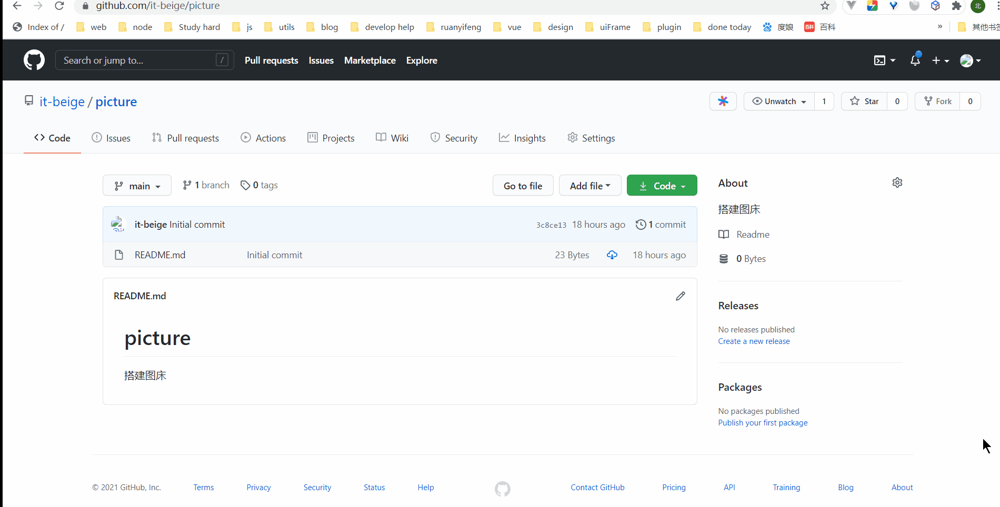
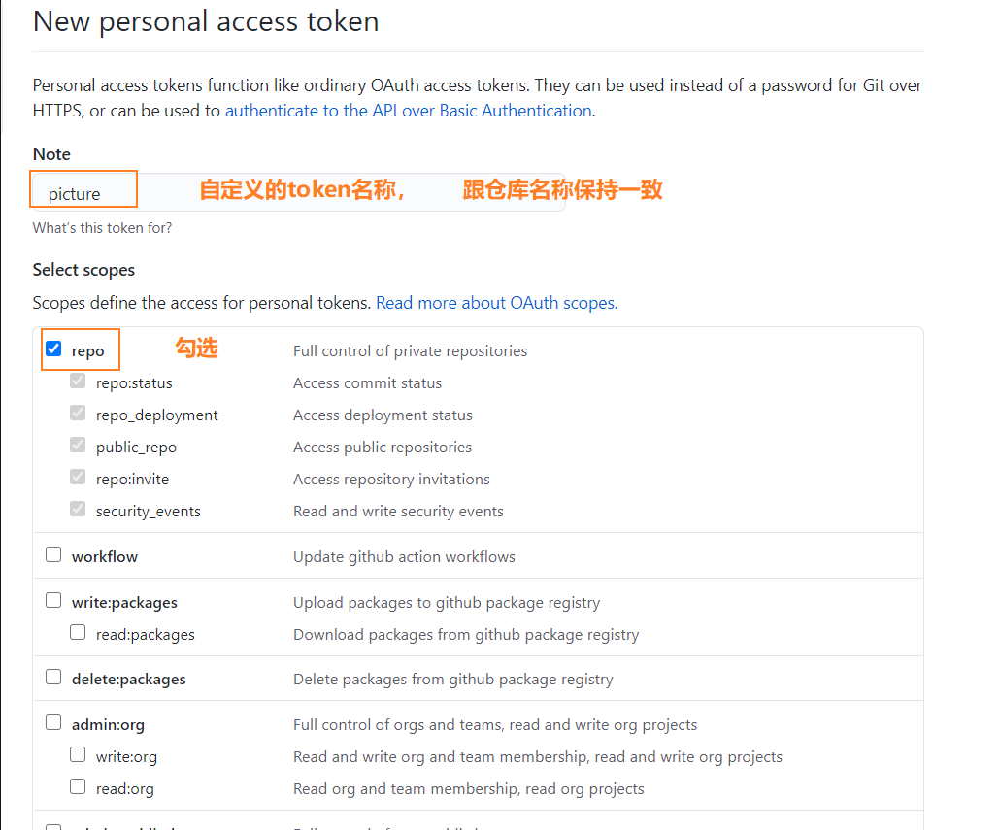
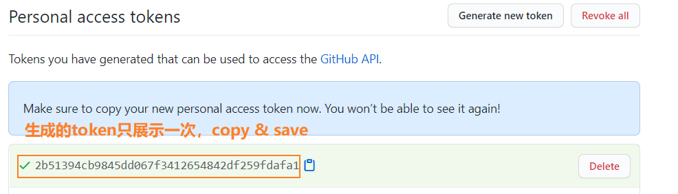
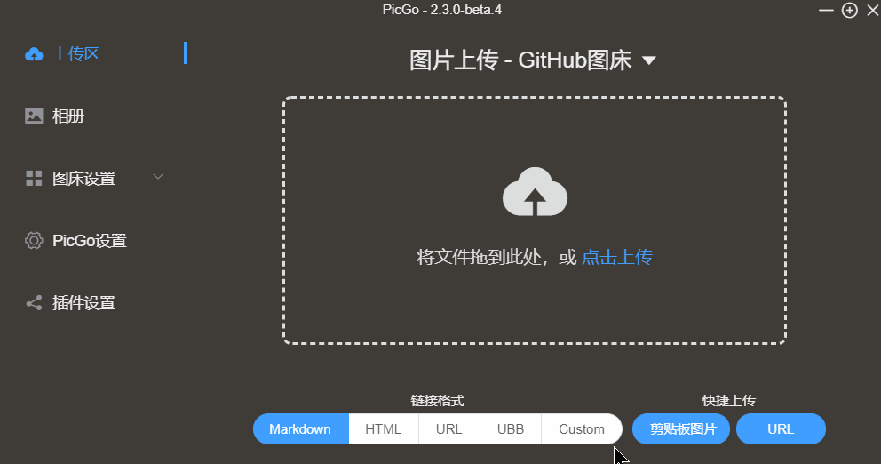

## 前言

相信不少小伙伴在写文章的时候想要发布文章到各个平台上去的时候，每次都要上传图片这个步骤，肯定让人感到很烦，特别是图特别多的时候就让人很崩溃了😑。这个时个搭建图床就非常方便了。

- PicGo (构建图床工具)
- Typora (一款支持实时预览的MD文本编辑器)
- GitHub （全国程序员交友平台）
- jsDeliv (开源CDN)
- Gitee (国内代码托管平台，如果没用Github也可以用Gitee)

PicGo(v2.3Beta)+ Typora(最新版)

云盘链接：https://pan.baidu.com/s/1VCmB0drvx2-WUg7fnXzW-w 
提取码：3210 

## GIthub

**New repository**


创建好之后你的仓库名一般都是这样：https://github.com/你的账户名/你刚取的仓库名。例 -> `https://github.com/it-beige/picture`

接下来配置下jsDeliv版本进行CDN加速, 先将你项目Clone下来push几张图片上去

```bash
git clone https://github.com/it-beige/picture
git remote -v 查看远程仓库
git add .
git commit -m '提交内容'
git pull origin main
git push origin main 
```

> 注意⚠：默认分支现在是main


**Settings**

点击头像找到Settings -> 左侧边栏找到Develop Settings -> Personal access tokens -> 点击Generate new token








## PicGo

> 软件上面已经分享过了，安装跳过，这里讲下配置

